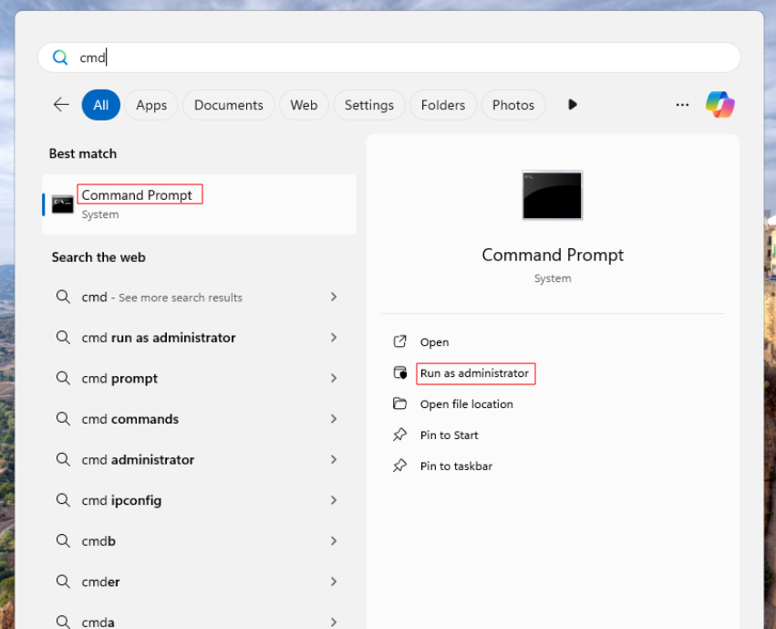
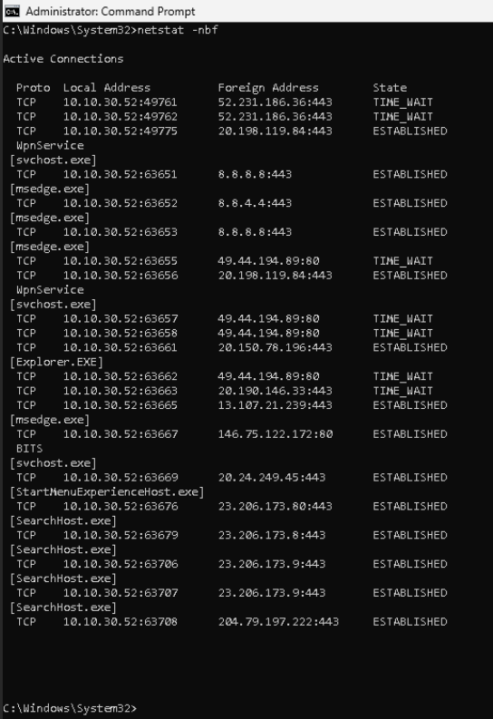
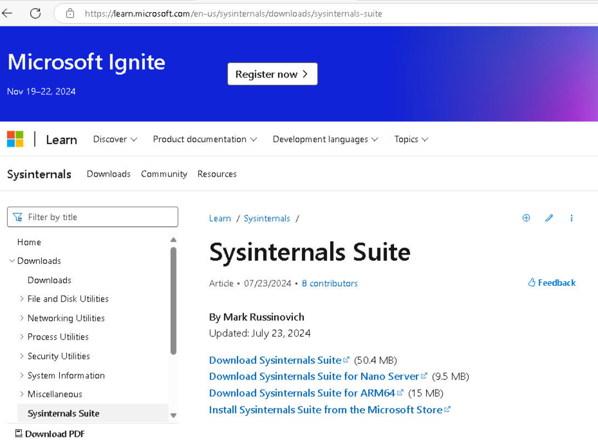
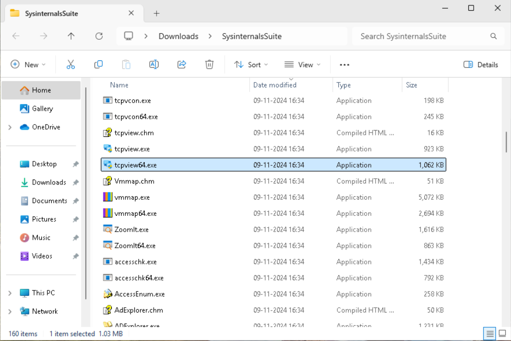
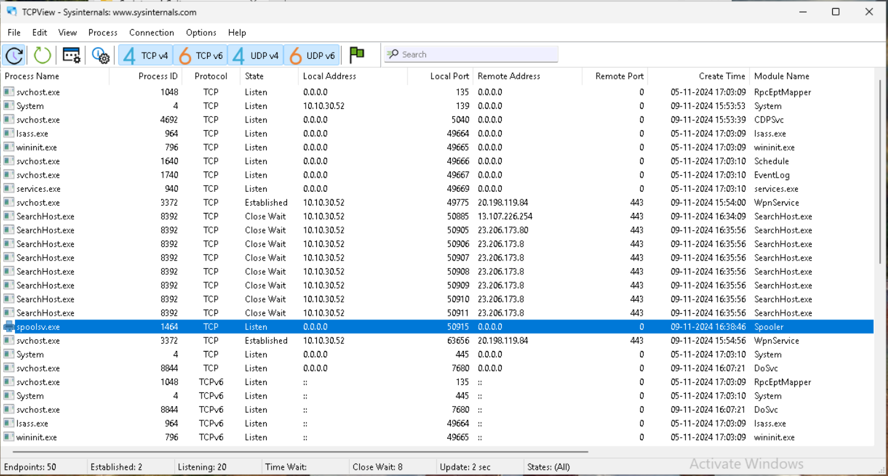
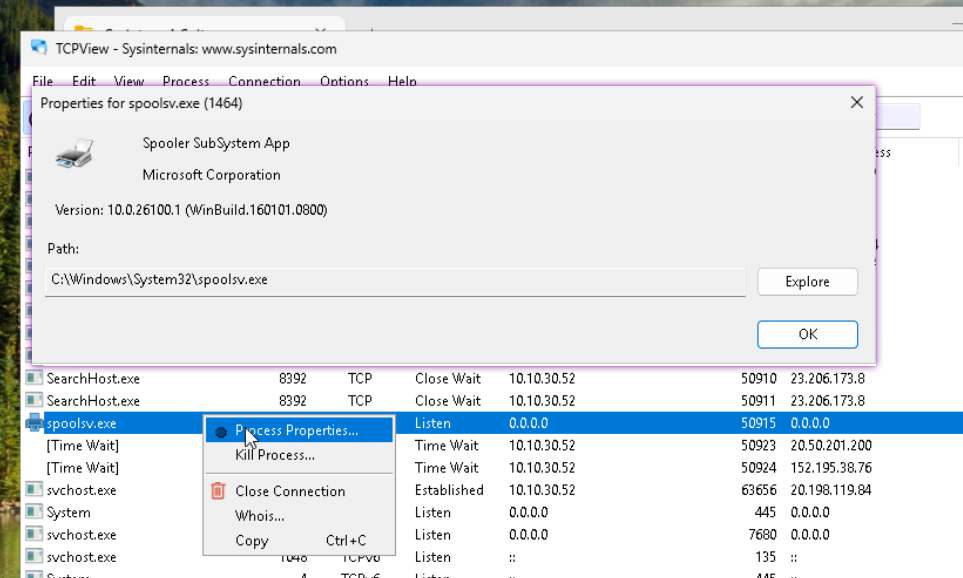
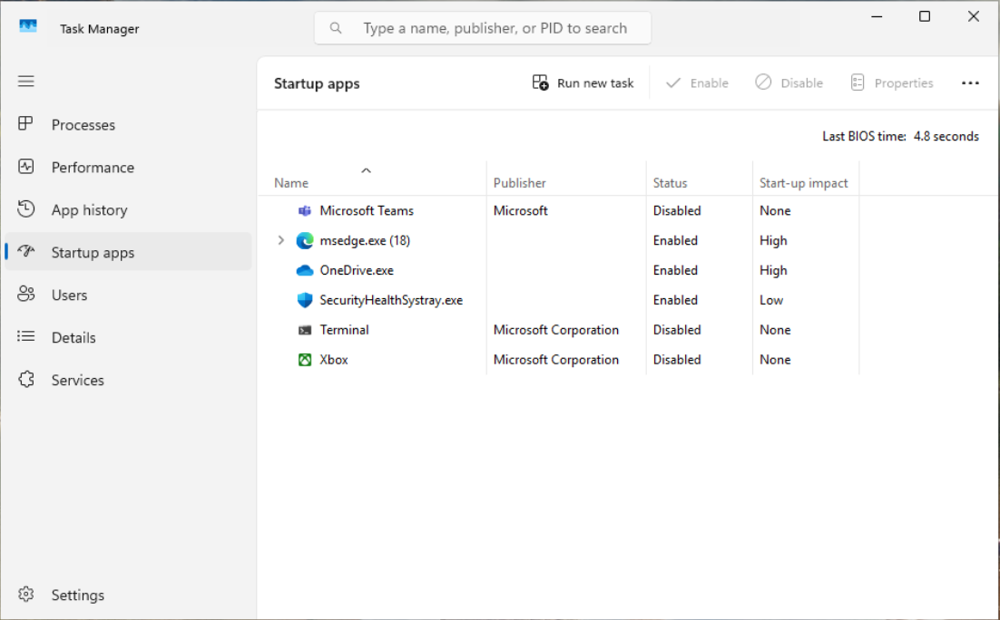
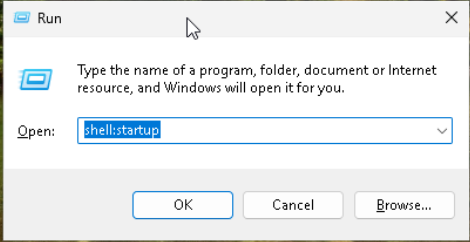
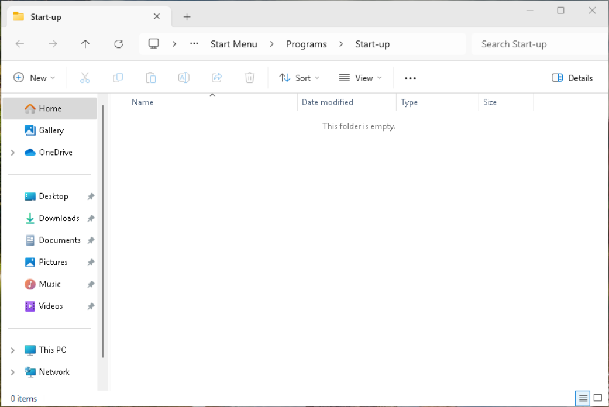
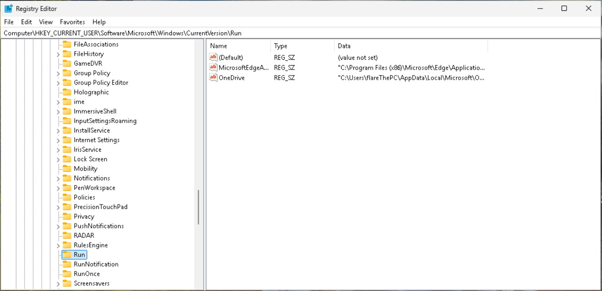

# are-you-HACKED?
In this tutorial, you'll know how to check if your system has been compromised. You'll learn how to spot unusual behavior, detect malware, inspect system logs, and run security scans. While these steps can help, if you still feel suspicious afterward, it's recommended to reach out to a professional for a more thorough check.

## Is Your System Acting Kinda Sus?

If you notice any of these signs, your PC may have been compromised:

- Unexplained system slowdowns or crashes.
- Unusual network activity (high data usage).
- Unknown programs or processes running.
- Pop-ups, redirects, or strange browser behavior.
- Suspicious account login activity or password changes.
- Antivirus or firewall disabled unexpectedly.
- Missing or altered files.
- Webcam or microphone turning on without permission.
- Files encrypted or system locked (ransomware).

## Disclaimer:

This tutorial provides a set of commonly used steps and commands to help identify potential security breaches on your system. While these methods are effective in detecting some of the most common signs of unauthorized access, they are not foolproof. If, after following all the recommended steps, you are still concerned or unsure about the security of your system, I recommend seeking professional assistance. It is best to consult with a qualified cybersecurity expert to ensure a thorough evaluation and resolution of any potential threats.

And, if your data isn't a big concern—well, just reinstall your favorite OS and start fresh! Sometimes, the simplest solution is the best.

Also, remember: sometimes the OS isn't where the virus or payload is hiding—it could be something else entirely. Make sure to check the screws on your laptop... you never know when the real threat is a sneaky hardware modification!

Credit:

## Let's Start with Network (Established Connection - Manual Way)

1. Open **CMD** as Administrator.



2. Command: `netstat -nbf` 



### Focus on ESTABLISHED State

As the name suggests, these are the established connections with your system. You can see which service or program is connected to which IP. 

One more efficient way to look for sketchy connections is by filtering the output by port numbers:

- Command: `netstat -nbf | find "3389"`
- Command: `netstat -nbf | find "5900"`

If nothing shows up, you're good.

If you find any suspicious service, you can end that connection. For example, if **Explorer.exe** is making you suspicious (even though it's a Windows process), you can kill it with:

- Command: `taskkill /im Explorer.exe /f`

**Note:** Before killing any process, make sure it's not related to any of your running applications. Just Google the process name, and you'll find more information.

To verify if it has ended, return to the first command and check if it's gone. It should be!


## Now Let's Head to GUI Mode

If you find the CLI confusing, don't worry! There's a more user-friendly way to do this in GUI mode. The previous steps were for the techy folks—now let's head to the GUI for a simpler approach.



### Download and Extract This Tool

It has lots of interesting programs you can use for System Monitoring, Diagnostics, Malware Analysis, Troubleshooting, File and Disk Management, etc.



### These Are All the Same Connections We Observed in the CLI

But with icons and in a more user-friendly form.



### To Learn More About the Processes

Simply right-click and select **Process Properties**. Here, you'll find the file path information. Just click **Explore**, and a window will open showing where the file is located.



### And the Main Part Here

This is where you can see all the connections and their states. Focus on the **Established** ones. If you feel suspicious about any, just hit **Kill Process**.

#### Two Things to Keep in Mind:

- The GUI makes things super friendly. You just open **tcpview64.exe**, scroll to look for any suspicious process, and simply by right-clicking, you can either explore more about the process or just kill the connection.
- There’s so much more you can do with these tools that I haven’t mentioned because I don’t want to make it too long. Just simple steps for now.

### TIPs: Look for These Common Locla Ports

| Port           | Protocol | Usage                                                   | Suspicious Activity                                                                 |
|----------------|----------|---------------------------------------------------------|--------------------------------------------------------------------------------------|
| **3389**       | TCP      | RDP (Remote Desktop Protocol)                           | Open without your knowledge—could indicate unauthorized remote access.              |
| **22**         | TCP      | SSH (Secure Shell)                                      | Unexpected connections could indicate remote access or a compromise.                |
| **4444**       | TCP      | Often used by Metasploit and remote shells               | Commonly used by malware/backdoors to control systems remotely.                      |
| **5555**       | TCP      | Used by some Android malware                            | Could indicate malware or backdoor installation, especially for Android-based attacks.|
| **31337**      | TCP      | Back Orifice (old remote access Trojan)                 | Often used by attackers for backdoor access to the system.                          |
| **8888**       | TCP      | P2P, Botnet, or HTTP Proxy                              | Unusual for legitimate software; could indicate botnet or proxy tool activity.      |
| **1337**       | TCP      | Malware or botnet activity                              | Often used by botnets for C&C (command and control) communication.                  |
| **Other high-numbered ports (1024-65535)** | TCP | Various application uses, often dynamic or private ports | Unusual open ports can indicate malware or unauthorized apps communicating with external servers. |

#### Key Things to Look for in TCPView:

- Unexpected connections to unfamiliar IP addresses or regions, especially if they are on uncommon ports.
- Processes that are listening on open ports (especially higher-numbered or well-known malicious ports) that shouldn’t be open.
- Frequent inbound or outbound traffic when you're not actively using your system could signal data exfiltration.

## Next Step: (Startup Folder)

When an attacker gains access to your computer, their next step is often to ensure continued access by making their payload run automatically when the PC boots. They often place their malware in startup folders, so when the operating system loads, it checks for programs to launch automatically. If their payload is there, it gets executed right away. This allows the malware to connect to their Command and Control (C2) server, maintaining persistent control over the system.

Now, let's check if the attacker has set their malware as a startup program on your system.

We will cover three different locations where startup programs are configured to run.

1. Hit **CTRL+SHIFT+ESC** to open **Task Manager** and go to the **Startup apps** tab.



   - Here, you can see all the programs that run at startup. If any of them look suspicious, right-click on the program and select **Disable**.

2. Hit **WIN+R** to open the **Run** command, then type: `shell:startup`.



   - Hit **Enter** or click **OK**, and a window will open showing the startup folder.



  - If you notice anything suspicious here (any unknown app), you can either delete it directly or explore the file path and remove the entire folder if necessary.

3. Hit **WIN+R** and type `regedit` to open the **Windows Registry Editor**. Then, navigate to the following path:
```Computer\HKEY_CURRENT_USER\Software\Microsoft\Windows\CurrentVersion\Run```



  - If you find something suspicious, just delete the program. But be careful—deleting certain programs can break your OS. Make sure you have a backup before making any modifications.
